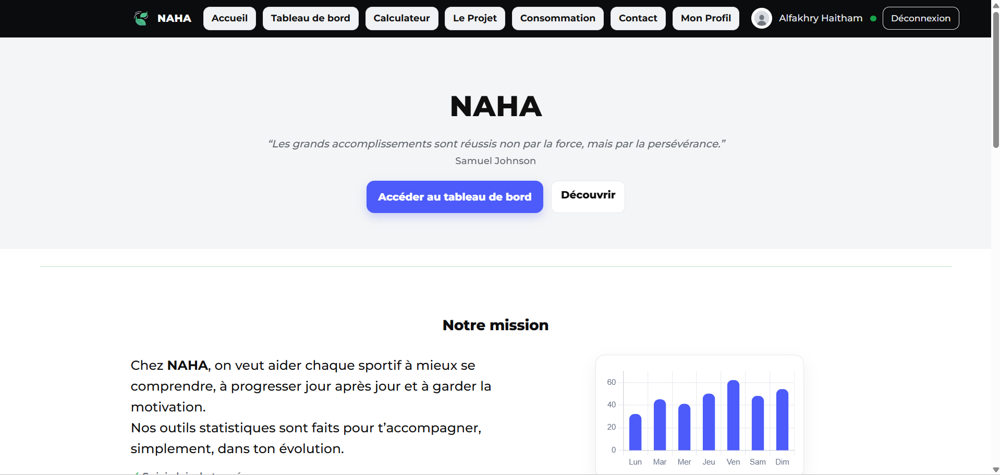
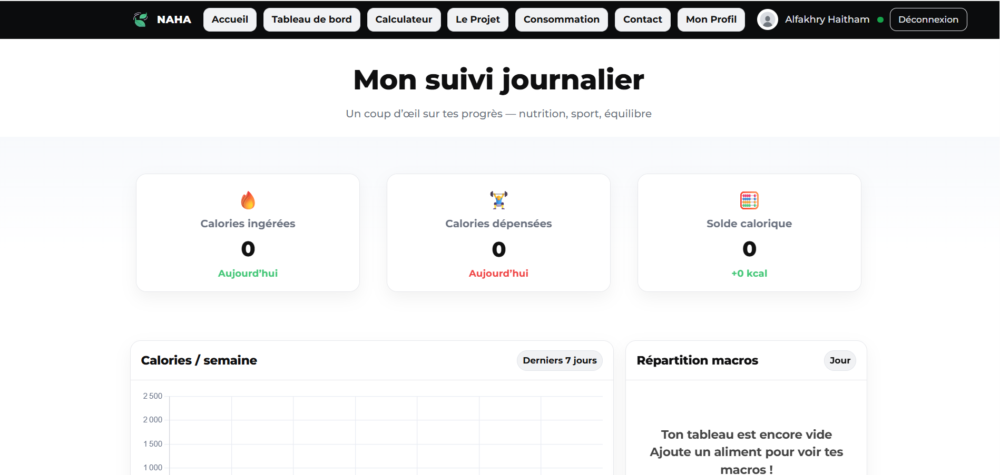
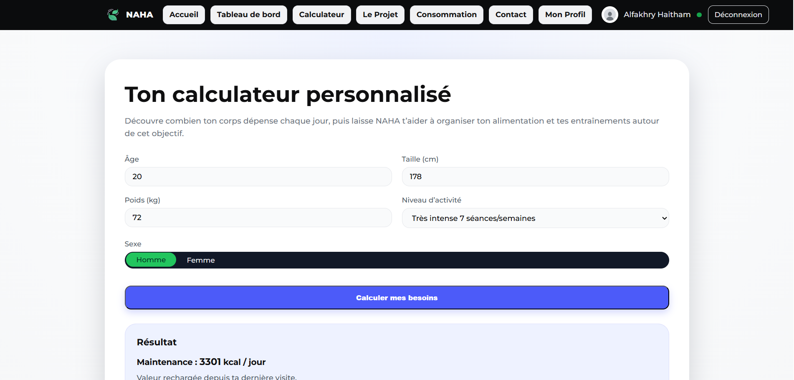
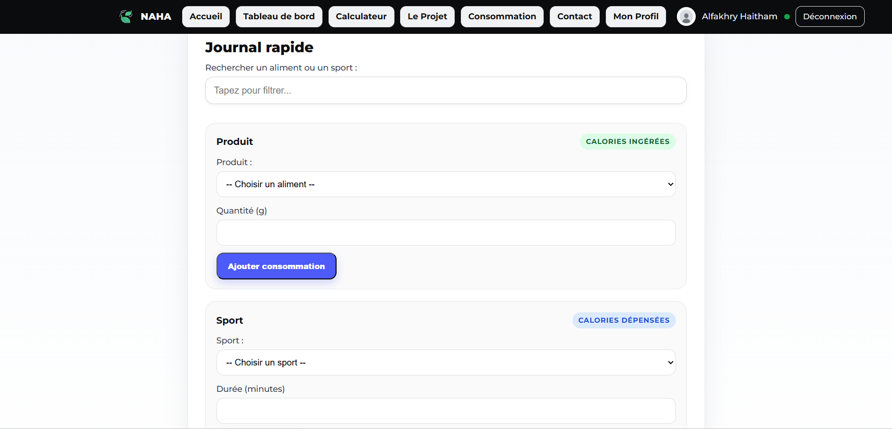
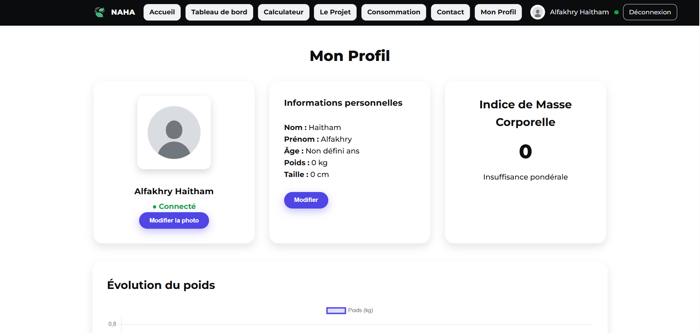

# 🥗 NAHA - Application de Suivi Nutrition & Fitness

## 🇫🇷 Description (Français)

NAHA est une application web moderne dédiée au suivi nutritionnel et sportif.  
Elle permet aux utilisateurs de :

- 📊 Suivre leurs calories quotidiennes (ingérées & dépensées)
- 🧮 Calculer leurs besoins caloriques personnalisés
- 📈 Visualiser l’évolution du poids
- 📉 Analyser la répartition des macronutriments
- 👤 Gérer leur profil personnel

L’objectif de NAHA est d’aider chaque sportif à mieux comprendre son corps, progresser jour après jour et rester motivé.

### ✨ Fonctionnalités principales

- Authentification utilisateur
- Tableau de bord interactif
- Calculateur de besoins caloriques
- Journal alimentaire et sportif
- Indice de Masse Corporelle (IMC)
- Graphiques dynamiques

---

## 🇬🇧 Description (English)

NAHA is a modern web application designed for nutrition and fitness tracking.  
It allows users to:

- 📊 Track daily calories (consumed & burned)
- 🧮 Calculate personalized calorie needs
- 📈 Monitor weight progress
- 📉 Analyze macronutrient distribution
- 👤 Manage personal profile

NAHA’s mission is to help athletes better understand their body, improve daily, and stay motivated.

### ✨ Key Features

- User authentication system
- Interactive dashboard
- Calorie needs calculator
- Food & sport journal
- Body Mass Index (BMI) calculation
- Dynamic charts and statistics

---

# 📸 Screenshots

## 🏠 Home Page

## 📊 Dashboard

## 🧮 Calorie Calculator

## 📘 Journal

## 👤 Profile

---

# 🛠 Technologies Used

- HTML5
- CSS3
- JavaScript
- Chart.js (for statistics)
- Responsive Design

---

# 📌 Future Improvements

- Dark mode
- Mobile optimization
- API food database integration
- Advanced analytics
